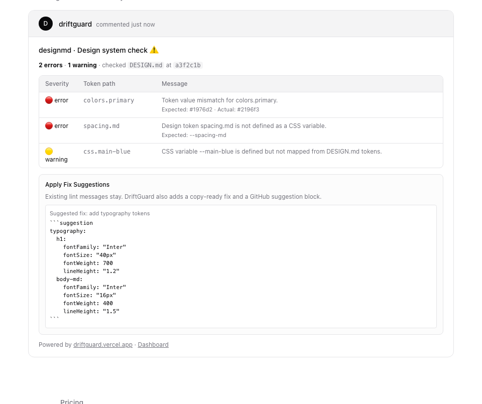
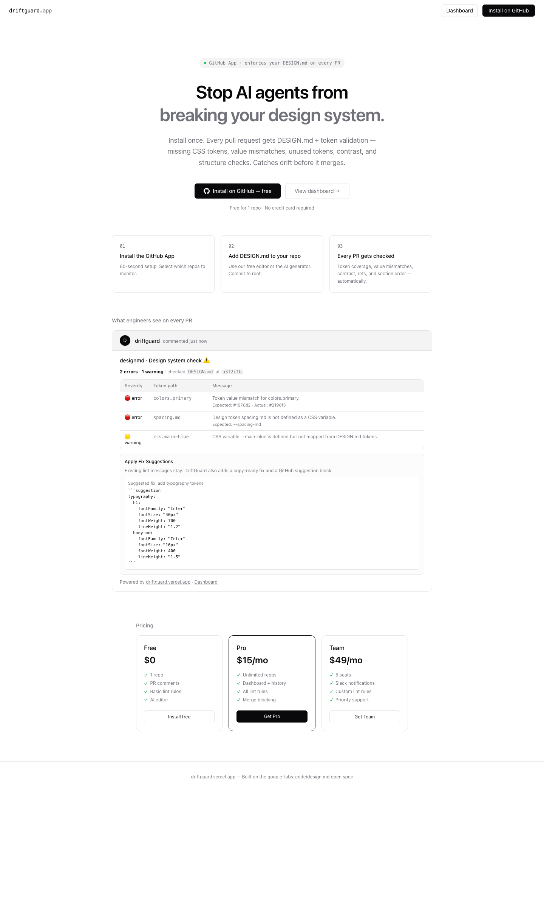
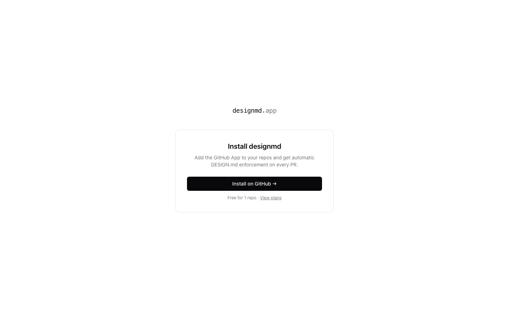
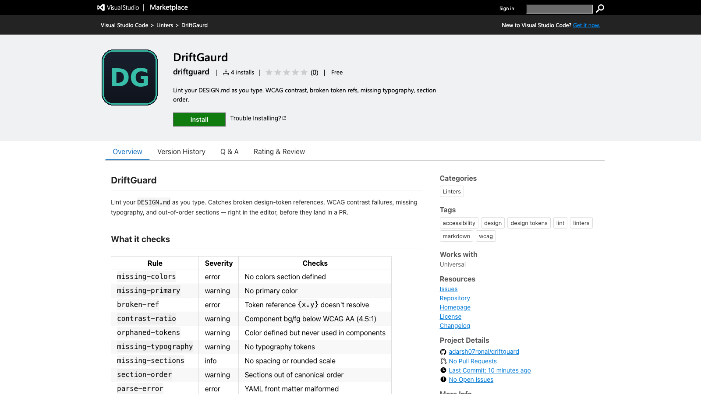
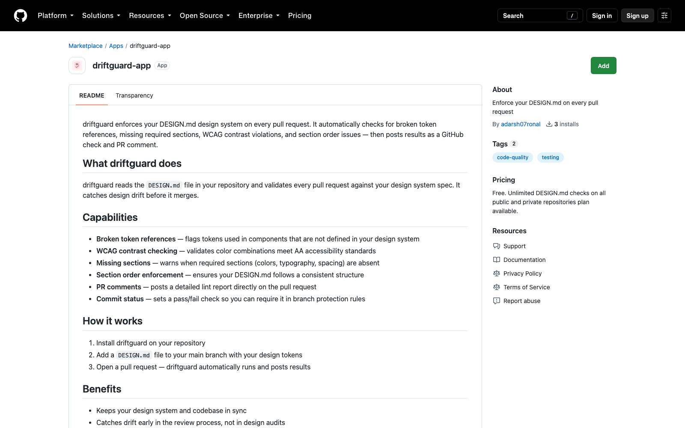
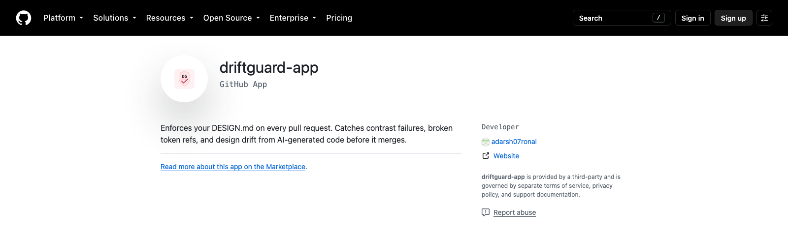

# designmd GitHub App

> Enforces your DESIGN.md on every pull request.

## What it does

1. Developer opens a PR
2. App fetches `DESIGN.md` from the PR branch
3. Runs lint checks: contrast ratios, broken token refs, missing typography, section order
4. Posts a comment with findings + sets commit status
5. Optionally blocks merge if errors exist (Pro+)

---

## Screenshots

Live captures from the production deployment and public listings — not mockups.

**The check every PR gets** — the app's homepage rendering the exact output of `buildPRComment()`, the same function that posts to real pull requests:



**Homepage** — [driftgaurd.vercel.app](https://driftgaurd.vercel.app):



**Install flow** — `/install`:



**Published on the VS Code Marketplace** — [driftgaurd.driftguard-vscode](https://marketplace.visualstudio.com/items?itemName=driftgaurd.driftguard-vscode):



**Published on GitHub Marketplace** — [github.com/marketplace/driftguard-app](https://github.com/marketplace/driftguard-app):



**Public GitHub App listing** — [github.com/apps/driftguard-app](https://github.com/apps/driftguard-app):



---

## Local setup

```bash
git clone https://github.com/yourname/designmd-app
cd designmd-app
cp .env.local.example .env.local
npm install
npm run dev
```

---

## GitHub App registration

### Option A — Manifest (easiest)

1. Go to `https://github.com/settings/apps/new`
2. Scroll to the bottom → "Register a GitHub App from a manifest"
3. Paste the contents of `github-app-manifest.json`
4. GitHub generates your App ID, Client ID, Client Secret, and Private Key
5. Copy all into `.env.local`

### Option B — Manual

Go to `https://github.com/settings/apps/new` and set:

| Field | Value |
|---|---|
| GitHub App name | `designmd` (or your own) |
| Homepage URL | `https://designmd.app` |
| Webhook URL | `https://yourapp.vercel.app/api/github/webhook` |
| Webhook secret | Any random string (copy to `GITHUB_WEBHOOK_SECRET`) |
| Callback URL | `https://yourapp.vercel.app/api/github/callback` |
| Setup URL | `https://yourapp.vercel.app/install` |

**Permissions:**
- Repository → Contents: Read
- Repository → Pull requests: Read & Write
- Repository → Commit statuses: Read & Write
- Account → Email addresses: Read

**Subscribe to events:**
- Pull request
- Installation
- Installation repositories

After creating:
- Copy **App ID** → `GITHUB_APP_ID`
- Copy **Client ID** → `GITHUB_CLIENT_ID`
- Generate **Client Secret** → `GITHUB_CLIENT_SECRET`
- Generate **Private Key** (download .pem) → paste into `GITHUB_APP_PRIVATE_KEY` replacing newlines with `\n`

---

## Testing webhooks locally

```bash
# Install smee (GitHub's webhook proxy)
npm install -g smee-client

# Start proxy
smee --url https://smee.io/YOUR_CHANNEL --target http://localhost:3000/api/github/webhook

# Set webhook URL in GitHub App settings to your smee.io URL
```

---

## Deploy to Vercel

```bash
npm install -g vercel
vercel

# Add env vars
vercel env add GITHUB_APP_ID
vercel env add GITHUB_APP_PRIVATE_KEY
vercel env add GITHUB_WEBHOOK_SECRET
vercel env add GITHUB_CLIENT_ID
vercel env add GITHUB_CLIENT_SECRET
# ... rest of vars

vercel --prod
```

After deploy, update webhook URL in GitHub App settings to:
`https://your-app.vercel.app/api/github/webhook`

---

## Supabase setup

1. Create project at [supabase.com](https://supabase.com)
2. Go to SQL Editor → paste `supabase-schema.sql` → Run
3. Copy URL + anon key + service role key → `.env.local`

---

## Project structure

```
src/
├── app/
│   ├── api/github/
│   │   ├── webhook/route.ts     # ← Core: handles all GitHub events
│   │   └── callback/route.ts   # OAuth login flow
│   ├── install/page.tsx         # Post-install landing page
│   ├── auth/page.tsx            # GitHub sign in
│   ├── dashboard/page.tsx       # User dashboard
│   └── page.tsx                 # Homepage / marketing
├── lib/
│   ├── github.ts                # Octokit, auth, helpers
│   ├── linter.ts                # DESIGN.md parser + lint rules
│   ├── comment.ts               # PR comment formatter
│   └── db.ts                    # Supabase helpers
└── types/index.ts
```

---

## Lint rules

| Rule | Severity | Checks |
|---|---|---|
| `missing-colors` | error | No colors section defined |
| `missing-primary` | warning | No primary color |
| `broken-ref` | error | Token reference `{x.y}` doesn't resolve |
| `contrast-ratio` | warning | Component bg/fg below WCAG AA (4.5:1) |
| `orphaned-tokens` | warning | Color defined but never used in components |
| `missing-typography` | warning | No typography tokens |
| `missing-sections` | info | No spacing or rounded scale |
| `section-order` | warning | Sections out of canonical order |
| `parse-error` | error | YAML front matter malformed |
